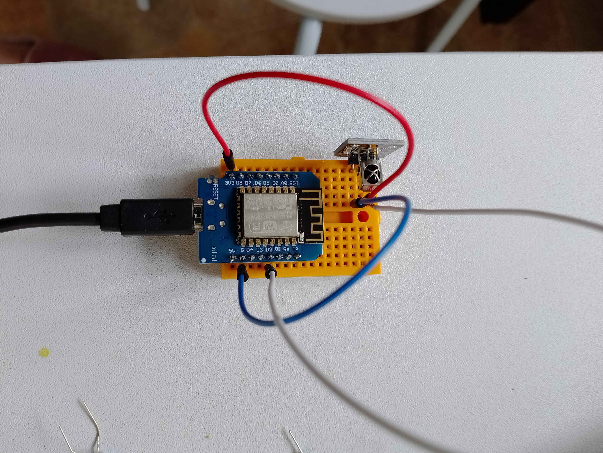

# Câblage de notre ESP8266-Mini:


# Référence des pins des GPIO en C-Arduino

````
==========================================================================================
#define led LED_BUILTIN
#define led 1 // TX = GPIO1
#define led 2 // D4 = GPIO2
#define led 3 // RX = GPIO3
#define led 4 // D2 = GPIO4
#define led 5 // D1 = GPIO5
#define led 12 // D6 = GPIO12
#define led 13 // D7 = GPIO13
#define led 14 // D5 = GPIO14
#define led 15 // D8 = GPIO15
#define led 16 // D0 = GPIO16
==========================================================================================
````


# Code pour recevoir les signaux de IR

````
==========================================================================================
#include <IRremote.hpp>

int IR_RECEIVE_PIN = 4 // D2;

decode_results results;

void setup()
{
  Serial.begin(115200);
  IrReceiver.begin(IR_RECEIVE_PIN, ENABLE_LED_FEEDBACK); // Start the receiver
}

void loop() {
  if (IrReceiver.decode()) {
     if (IrReceiver.decodedIRData.decodedRawData != 0) {
        Serial.println(IrReceiver.decodedIRData.decodedRawData, HEX);
        // IrReceiver.printIRResultShort(&Serial); // optional use new print version
     }
     IrReceiver.resume(); // Enable receiving of the next value
  }  delay(10);
}
==========================================================================================
````




# Câblage (dos de la led IR):

+ ground = G
+ rouge = 3V3
+ (S) = D2 (=GPIO4) signal

# Décodage des touches de notre télécommande


````
09:29:34.132 -> BB44FF00  gauche
09:29:36.665 -> B946FF00  haut
09:29:39.075 -> BC43FF00  droite
09:29:42.481 -> EA15FF00  bas

                BF40FF00  OK

09:33:18.071 -> E916FF00 1
09:33:21.278 -> E619FF00 2
09:33:23.903 -> F20DFF00 3
09:33:26.445 -> F30CFF00 4
09:33:28.667 -> E718FF00 5
09:33:30.926 -> A15EFF00 6
09:33:33.198 -> F708FF00 7
09:33:42.631 -> E31CFF00 8
09:33:45.272 -> A55AFF00 9
09:33:48.100 -> AD52FF00 0
````


# Montage moteur

+ un moteur soudé: un fil rouge (à droite) un fil noir (à gauche) 
+ un pont H (moteur A) 
  + côté bornier: fil noir à droite - fil rouge à gauche
  + côté CPU: fil rouge VCC | fil noir A-IA | fil blanc A-IB
+ CPU: 
  + rouge: 5V
  + noir: D1
  + blanc: D2
  


## Câblage

````
#include <Arduino.h>


#define D6 12  // B-2A vert pont H pour le moteur Droite
#define D5 14  // B-1A jaune

#define D2 4   // A-1B vert pont H pour le moteur Gauche (B)
#define D1 5   // A-1A jaune


void setup() {
  Serial.begin(115200);
  pinMode(D1, OUTPUT);
  pinMode(D2, OUTPUT);
  pinMode(D5, OUTPUT);
  pinMode(D6, OUTPUT);
}

void loop() {
    // recule  
    analogWrite(D1, vmax);
    analogWrite(D2, 0);
    analogWrite(D5, vmax);
    analogWrite(D6, 0);
    delay(10000);
    // avance
    analogWrite(D1, 0);
    analogWrite(D2, vmax);
    analogWrite(D5, 0);
    analogWrite(D6, vmax);
    delay(5000);
}

````